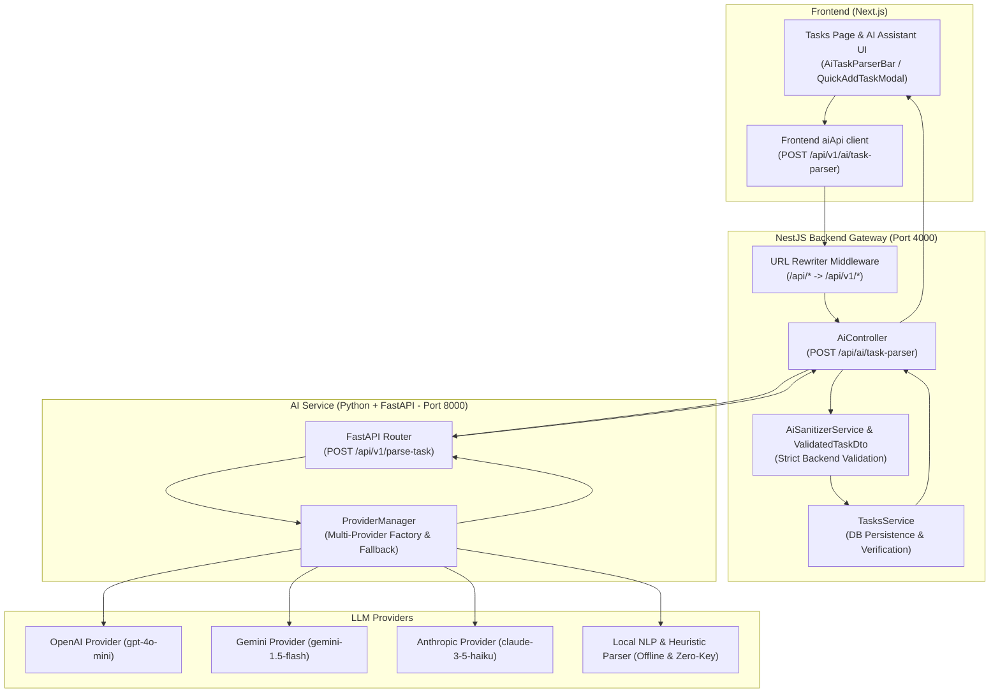

# STEP 10: AI Task Parser - System Architecture & Verification Report

## 1. Architectural Overview

> [!IMPORTANT]
> **Zero LLM Exposure to Frontend**: The frontend **NEVER** calls an LLM provider directly. All interactions flow strictly through the NestJS backend gateway which queries the Python FastAPI microservice.
> **Backend AI Validation Boundary**: Raw AI outputs are never permitted to touch the database. The NestJS `AiSanitizerService` validates and normalizes all fields against `ValidatedTaskDto` and `CreateTaskDto` before database transactions.

---

## 2. Implemented Components

### A. Python FastAPI AI Microservice (`ai-service/`)
- [main.py](file:///c:/Users/BISHNU%20PRASAD%20BISOI/Desktop/LifePilote/ai-service/app/main.py): FastAPI application with CORS middleware, health endpoints, and router registration.
- [schemas/task_parser.py](file:///c:/Users/BISHNU%20PRASAD%20BISOI/Desktop/LifePilote/ai-service/app/schemas/task_parser.py): Pydantic models (`TaskParseRequest`, `TaskParseResponse`, `ParsedTask`) and enums (`TaskCategory`, `TaskPriority`, `RecurrenceInterval`).
- [providers/base.py](file:///c:/Users/BISHNU%20PRASAD%20BISOI/Desktop/LifePilote/ai-service/app/providers/base.py): `BaseLLMProvider` abstract interface.
- [providers/local_parser.py](file:///c:/Users/BISHNU%20PRASAD%20BISOI/Desktop/LifePilote/ai-service/app/providers/local_parser.py): High-performance rule-based and regex NLP parser supporting relative dates ("tomorrow", "next Monday", "in 3 days"), times (12h/24h), durations, recurrence rules (`RRULE`), deadlines, category heuristics, and priority keywords.
- [providers/openai_provider.py](file:///c:/Users/BISHNU%20PRASAD%20BISOI/Desktop/LifePilote/ai-service/app/providers/openai_provider.py): OpenAI JSON Schema integration.
- [providers/gemini_provider.py](file:///c:/Users/BISHNU%20PRASAD%20BISOI/Desktop/LifePilote/ai-service/app/providers/gemini_provider.py): Google Gemini integration.
- [providers/anthropic_provider.py](file:///c:/Users/BISHNU%20PRASAD%20BISOI/Desktop/LifePilote/ai-service/app/providers/anthropic_provider.py): Anthropic Claude integration.
- [providers/factory.py](file:///c:/Users/BISHNU%20PRASAD%20BISOI/Desktop/LifePilote/ai-service/app/providers/factory.py): Provider manager with dynamic registration, switching, and auto-fallback.
- [routers/task_parser.py](file:///c:/Users/BISHNU%20PRASAD%20BISOI/Desktop/LifePilote/ai-service/app/routers/task_parser.py): Router exposing `POST /api/v1/parse-task` and `GET /api/v1/providers`.

### B. NestJS Backend Gateway (`backend/src/ai/`)
- [ai.controller.ts](file:///c:/Users/BISHNU%20PRASAD%20BISOI/Desktop/LifePilote/backend/src/ai/ai.controller.ts): Exposes `POST /api/ai/task-parser` (and `/api/v1/ai/task-parser`) and `GET /api/ai/providers`.
- [ai.service.ts](file:///c:/Users/BISHNU%20PRASAD%20BISOI/Desktop/LifePilote/backend/src/ai/ai.service.ts): Communicates with the AI microservice, enforces validation, and handles optional database persistence (`autoCreate: true`).
- [ai-sanitizer.service.ts](file:///c:/Users/BISHNU%20PRASAD%20BISOI/Desktop/LifePilote/backend/src/ai/ai-sanitizer.service.ts): Sanitizes HTML/scripts, normalizes dates/times, validates enums, clamps duration (1-1440 mins), and maps to `CreateTaskDto`.
- [dto/validated-task.dto.ts](file:///c:/Users/BISHNU%20PRASAD%20BISOI/Desktop/LifePilote/backend/src/ai/dto/validated-task.dto.ts): Strict class-validator DTO for backend validation of LLM output.
- [dto/parse-task-request.dto.ts](file:///c:/Users/BISHNU%20PRASAD%20BISOI/Desktop/LifePilote/backend/src/ai/dto/parse-task-request.dto.ts): Request DTO supporting `text`, `prompt`, `timezone`, `referenceDate`, and `autoCreate`.
- [ai.module.ts](file:///c:/Users/BISHNU%20PRASAD%20BISOI/Desktop/LifePilote/backend/src/ai/ai.module.ts): Module registered in `AppModule`.

### C. Next.js Frontend Integration (`frontend/`)
- [lib/ai-api.ts](file:///c:/Users/BISHNU%20PRASAD%20BISOI/Desktop/LifePilote/frontend/src/lib/ai-api.ts): Typed API client communicating exclusively with NestJS.
- [components/dashboard/ai-task-parser-bar.tsx](file:///c:/Users/BISHNU%20PRASAD%20BISOI/Desktop/LifePilote/frontend/src/components/dashboard/ai-task-parser-bar.tsx): Glassmorphism input bar with example chips, real-time structured preview card, badge indicators, and 1-click database persistence.
- [app/(dashboard)/tasks/page.tsx](file:///c:/Users/BISHNU%20PRASAD%20BISOI/Desktop/LifePilote/frontend/src/app/(dashboard)/tasks/page.tsx): Embedded `AiTaskParserBar` directly above the smart task manager.
- [components/dashboard/quick-add-task-modal.tsx](file:///c:/Users/BISHNU%20PRASAD%20BISOI/Desktop/LifePilote/frontend/src/components/dashboard/quick-add-task-modal.tsx): Added AI Magic Autofill bar.
- [app/(dashboard)/ai-assistant/page.tsx](file:///c:/Users/BISHNU%20PRASAD%20BISOI/Desktop/LifePilote/frontend/src/app/(dashboard)/ai-assistant/page.tsx): Natural language task parsing within the AI Copilot conversation with direct database task saving.

---

## 3. Supported Natural Language Capabilities

| Dimension | Supported Expressions | Extracted Attributes |
| :--- | :--- | :--- |
| **Dates** | "today", "tomorrow", "day after tomorrow", "next Friday", "in 3 days", "Oct 15" | `date: "YYYY-MM-DD"`, `dueDate` |
| **Times** | "7 PM", "19:00", "6:30 AM", "morning" (09:00), "afternoon" (14:00), "evening" (18:00) | `time: "HH:MM"`, `startTime: "HH:MM"` |
| **Duration** | "for 1 hour", "for 2 hours", "45 minutes", "1.5 hours", "30 mins" | `duration: 60`, `endTime: "20:00"` |
| **Categories** | Keywords for Study, Work, Fitness, Health, Finance, Personal | `category: STUDY \| WORK \| FITNESS \| HEALTH \| FINANCE \| PERSONAL` |
| **Priorities** | "urgent", "critical", "asap", "high priority", "important", "low priority" | `priority: CRITICAL \| HIGH \| MEDIUM \| LOW` |
| **Recurrence** | "every Sunday", "every day", "daily", "every week", "every month" | `isRecurring: true`, `recurrenceInterval: WEEKLY`, `recurrenceRule: "FREQ=WEEKLY;BYDAY=SU"` |
| **Deadlines** | "before Friday 5 PM", "by tomorrow 6 PM", "due Friday" | `deadline: "2026-10-09T17:00:00"` |

---

## 4. Test Verification Results

| Test Suite | Commands Run | Tests Count | Status |
| :--- | :--- | :---: | :---: |
| **Python Unit Tests** | `pytest test_suite.py` | 6 | **6 / 6 PASSED** |
| **Python API Tests** | `pytest test_api.py` | 4 | **4 / 4 PASSED** |
| **Backend Sanitizer Tests** | `npx ts-node test/ai-sanitizer.test.ts` | 17 | **17 / 17 PASSED** |
| **Backend Integration Suite** | `npm run test:ai` | 31 | **31 / 31 PASSED** |
| **End-to-End Root Flow** | `node test_ai_task_parser.js` | 22 | **22 / 22 PASSED** |
| **Frontend Production Build** | `npm run build` | 20 routes | **COMPILED CLEANLY** |
