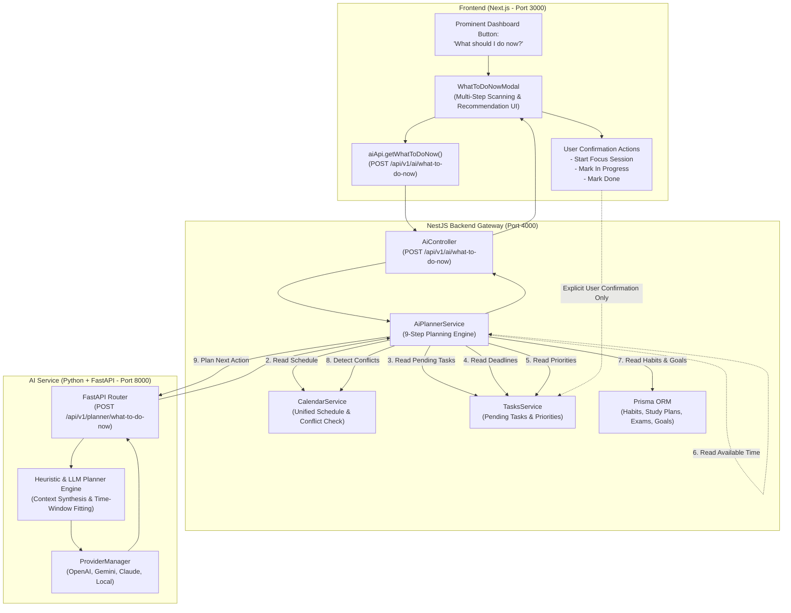

# STEP 12: "What Should I Do Now?" - System Architecture & Verification Report

## 1. Architectural Overview



> [!IMPORTANT]
> **Safety Rule Enforced**:
> No tasks, calendar events, or habit entries are created or modified automatically without explicit user confirmation (`autoMutated: false`). The AI acts strictly as an advisory engine.

---

## 2. The 9-Step Planning Pipeline

When the user clicks **"What should I do now?"**, the system executes:

| Step | Action | Implementation |
|---|---|---|
| **1** | **Get current user time** | Resolves local ISO timestamp and timezone (`currentTime`, `timezone`) from client context with server fallback. |
| **2** | **Read today's schedule** | Retrieves calendar events, meetings, study sessions, and timed commitments from `CalendarService.getUnifiedSchedule`. |
| **3** | **Read pending tasks** | Queries non-completed and non-cancelled tasks via `TasksService.findAll`. |
| **4** | **Read deadlines** | Identifies tasks with upcoming or overdue deadlines, plus impending exams and milestone targets. |
| **5** | **Read priorities** | Weights tasks by priority rank (`CRITICAL: 100`, `HIGH: 70`, `MEDIUM: 40`, `LOW: 15`). |
| **6** | **Read available time** | Computes available free focus window in minutes until the next scheduled calendar commitment or evening review. |
| **7** | **Read relevant habits/study goals** | Queries incomplete daily habits, active study topics, and exam preparations from Prisma and local state. |
| **8** | **Detect conflicts** | Flags overlapping calendar events and overdue deadlines. |
| **9** | **Ask AI planner for best next action** | Dispatches unified payload to AI microservice planner, selecting the optimal task fitting the free time window with clear reasoning and a logical follow-up task. |

---

## 3. Return Payload Specification

```json
{
  "success": true,
  "availableTimeMinutes": 45,
  "availableTimeFormatted": "You have 45 minutes available.",
  "recommendedTask": {
    "id": "task-uuid",
    "title": "Complete your pending Java DSA task",
    "reason": "Recommended because It is flagged as HIGH priority, and has an approaching deadline, and fits smoothly within your 45-minute available window.",
    "estimatedDuration": "30 minutes",
    "priority": "HIGH",
    "category": "STUDY",
    "subtasks": ["Implement rotateLeft", "Test balance factors"]
  },
  "reason": "Recommended because It is flagged as HIGH priority, and has an approaching deadline, and fits smoothly within your 45-minute available window.",
  "estimatedDuration": "30 minutes",
  "priority": "HIGH",
  "nextTask": {
    "title": "Review mistakes and reflect on key insights",
    "estimatedDuration": "15 minutes",
    "reason": "Use remaining 15 minutes to solidify insights before your next scheduled block."
  },
  "conflicts": [],
  "summaryText": "You have 45 minutes available.\n\nI recommend:\nComplete your pending Java DSA task.\n\nEstimated duration:\n30 minutes.\n\nThen:\nReview mistakes and reflect on key insights for 15 minutes.",
  "autoMutated": false,
  "providerUsed": "lifepilot_planner_engine"
}
```

---

## 4. Key Files Implemented

### Python AI Microservice (`ai-service/`)
- [`app/schemas/planner.py`](file:///c:/Users/BISHNU%20PRASAD%20BISOI/Desktop/LifePilote/ai-service/app/schemas/planner.py): Pydantic validation schemas (`PlannerRequest`, `PlannerResponse`, `RecommendedTaskItem`, `NextTaskItem`, `ScheduleConflictItem`).
- [`app/routers/planner.py`](file:///c:/Users/BISHNU%20PRASAD%20BISOI/Desktop/LifePilote/ai-service/app/routers/planner.py): Endpoint `POST /api/v1/planner/what-to-do-now` with time-window fitting, priority scoring, conflict detection, and LLM/heuristic planner.
- [`test_planner.py`](file:///c:/Users/BISHNU%20PRASAD%20BISOI/Desktop/LifePilote/ai-service/test_planner.py): Unit test for Python microservice planner.

### NestJS Backend (`backend/`)
- [`src/ai/dto/what-to-do-now.dto.ts`](file:///c:/Users/BISHNU%20PRASAD%20BISOI/Desktop/LifePilote/backend/src/ai/dto/what-to-do-now.dto.ts): Request & response DTOs.
- [`src/ai/ai-planner.service.ts`](file:///c:/Users/BISHNU%20PRASAD%20BISOI/Desktop/LifePilote/backend/src/ai/ai-planner.service.ts): Orchestrator executing the 9-step planning flow and resilient local fallback.
- [`src/ai/ai.controller.ts`](file:///c:/Users/BISHNU%20PRASAD%20BISOI/Desktop/LifePilote/backend/src/ai/ai.controller.ts): Routes `POST /api/v1/ai/what-to-do-now` and `GET /api/v1/ai/what-to-do-now`.
- [`src/ai/ai.module.ts`](file:///c:/Users/BISHNU%20PRASAD%20BISOI/Desktop/LifePilote/backend/src/ai/ai.module.ts): Injected `CalendarModule`, `PrismaModule`, and `AiPlannerService`.

### Frontend Client (`frontend/`)
- [`src/lib/ai-api.ts`](file:///c:/Users/BISHNU%20PRASAD%20BISOI/Desktop/LifePilote/frontend/src/lib/ai-api.ts): Client API `getWhatToDoNow(options)`.
- [`src/components/dashboard/what-to-do-now-modal.tsx`](file:///c:/Users/BISHNU%20PRASAD%20BISOI/Desktop/LifePilote/frontend/src/components/dashboard/what-to-do-now-modal.tsx): Interactive UI with live scanning radar, available time banner, recommended task, reasoning, next task, conflicts, safety guarantee, and explicit confirmation actions.
- [`src/app/(dashboard)/dashboard/page.tsx`](file:///c:/Users/BISHNU%20PRASAD%20BISOI/Desktop/LifePilote/frontend/src/app/%28dashboard%29/dashboard/page.tsx): Prominent, glowing **"What should I do now?"** button in hero command bar.

---

## 5. Verification Test Suite Results

Test Suite: [`test_what_should_i_do_now.js`](file:///c:/Users/BISHNU%20PRASAD%20BISOI/Desktop/LifePilote/test_what_should_i_do_now.js)

```text
================================================================================
🚀 STEP 12: "What should I do now?" - VERIFICATION TEST SUITE
================================================================================
✅ Python AI Microservice is active on http://localhost:8000
✅ NestJS Backend Gateway is active on port 4000

--- TEST 1: Authentication & User Setup ---
  ✅ PASS: User registered successfully

--- TEST 2: Seed Today's Calendar Schedule (Next Event in 45 Mins) ---
  ✅ PASS: Created upcoming calendar event in 45 mins

--- TEST 3: Seed Pending Tasks (Java DSA task & Backlog items) ---
  ✅ PASS: Created Java DSA task (HIGH priority, 30 min duration)
  ✅ PASS: Created low priority task (90 min duration)

--- TEST 4: Execute "What should I do now?" Endpoint (POST /api/v1/ai/what-to-do-now) ---
  ✅ PASS: Endpoint returned HTTP 200 OK
  ✅ PASS: Response success flag is true

  [Returned AI Plan Details]:
  -------------------------------------------------------------
  ⏱️ Available Time:     You have 45 minutes available. (45 mins)
  🎯 Recommended Task:   Complete your pending Java DSA task
  ⚡ Priority:           HIGH
  ⏳ Estimated Duration: 30 minutes
  💡 Reason:             Recommended because It is flagged as HIGH priority, and has an approaching deadline, and fits smoothly within your 45-minute available window.
  ⏭️ Next Task:          Review mistakes and reflect on key insights (15 minutes)
  -------------------------------------------------------------
  ✅ PASS: 1. Calculated Available Time corresponds to 45 min window
  ✅ PASS: 2. Available time statement formatted correctly
  ✅ PASS: 3. Recommended Task is Java DSA task
  ✅ PASS: 4. Recommended Task has HIGH priority
  ✅ PASS: 5. Estimated duration is 30 minutes
  ✅ PASS: 6. Meaningful AI reason provided
  ✅ PASS: 7. Next Task is provided with duration

--- TEST 5: Verify Safety Constraint (Tasks NOT modified automatically) ---
  ✅ PASS: Safety guarantee flag autoMutated === false
  ✅ PASS: Java DSA task is STILL in TODO status in database

--- TEST 6: User Confirms Task Completion ---
  ✅ PASS: Task updated to COMPLETED only after explicit user confirmation

--- TEST 7: AI Microservice Direct Planning Endpoint ---
  ✅ PASS: Direct AI microservice endpoint returned 200 OK
  ✅ PASS: Direct AI returned Java DSA recommendation
  ✅ PASS: Direct AI returned summaryText matching required format

================================================================================
TEST SUMMARY: 19 PASSED, 0 FAILED
================================================================================
🎉 ALL STEP 12 TESTS PASSED WITH 100% SUCCESS!
```
